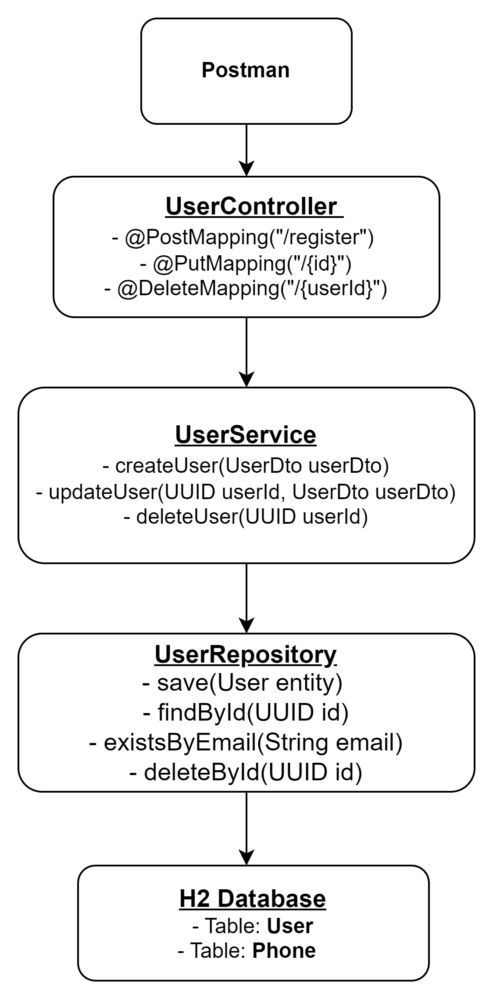

# User Registration Service

## Descripción

Este proyecto proporciona una API RESTful para la gestión de usuarios. Permite registrar, actualizar y eliminar usuarios. Cada usuario puede tener uno o más números de teléfono asociados.

## Requisitos

- JDK 11 o superior
- Maven 3.6 o superior

## Configuración del Proyecto

1. **Clonar el Repositorio**

   ```bash
   git clone https://github.com/tu_usuario/user-registration-service.git
2.  **Construir el Proyecto**

   ```bash
   mvn clean install
3. **Ejecutar la Aplicación**

  ```bash
     mvn spring-boot:run
  ```

## La aplicación se ejecutará en la URL
http://localhost:8080.

## Endpoints
### Registrar Usuario

URL: /api/users/register

Método: POST

Request Body:

```json
{
  "name": "Juan Rodriguez",
  "email": "juan@rodriguez.org",
  "password": "Hunter2@",
  "phones": [
    {
      "number": "1234567",
      "cityCode": "1",
      "countryCode": "57"
    }
  ]
}
```
Response Body:

```json
{
"id": "fb937c40-c2ee-4a2b-91a3-ca754a9a9756",
"created": "17/08/2024",
"modified": "17/08/2024",
"lastLogin": "17/08/2024",
"token": "baaa4298-fd79-41e4-afc3-5d662c2cf208",
"active": true
}
````

### Actualizar Usuario
URL: /api/users/{id}

Método: PUT

Request Body: Mismo formato que para el registro.

Response: Mismo formato que para el registro.

### Eliminar Usuario

URL: /api/users/{id}

Método: DELETE

Response:

Código de Estado 200: Usuario eliminado exitosamente.

Código de Estado 404: Usuario no encontrado.

## Pruebas Unitarias
Las pruebas unitarias aseguran que la lógica de negocio se comporta como se espera. se encuentran en el paquete 
````bash
src/test/java.
````
Para ejecutar las pruebas, usa el siguiente comando:
````bash
mvn test
````

## Configuración de Jacoco para Cobertura de Código
Para configurar Jacoco y excluir ciertos paquetes de la cobertura, agrega la siguiente configuración a tu pom.xml:

````xml
<plugin>
<groupId>org.jacoco</groupId>
<artifactId>jacoco-maven-plugin</artifactId>
<version>0.8.8</version>
<executions>
<execution>
<goals>
<goal>prepare-agent</goal>
<goal>report</goal>
</goals>
</execution>
</executions>
<configuration>
<excludes>
<exclude>com.example.user_registration.model.*</exclude>
<exclude>com.example.user_registration.dto.*</exclude>
</excludes>
</configuration>
</plugin>
````
## Swagger
Para visualizar la documentación de la API, usa Swagger. 
La documentación está disponible en el paquete Swagger.

## Diagrama de solucion
